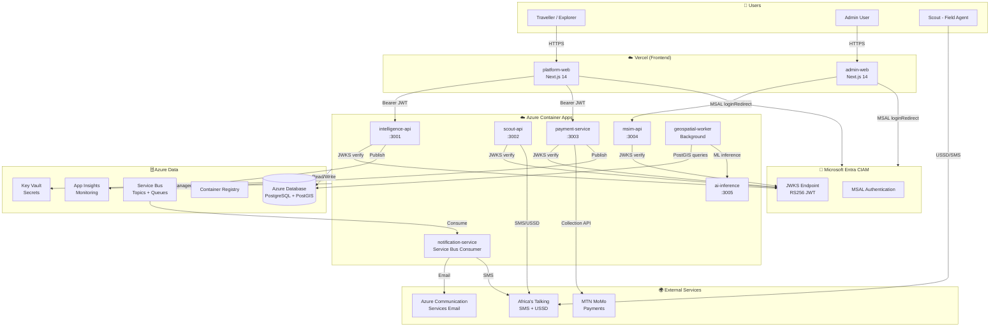
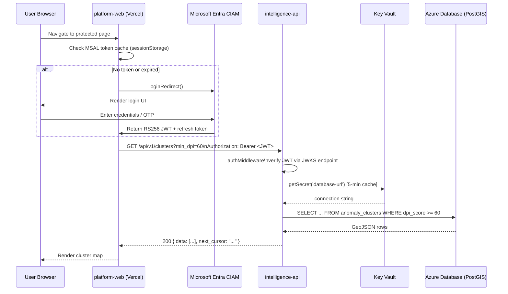
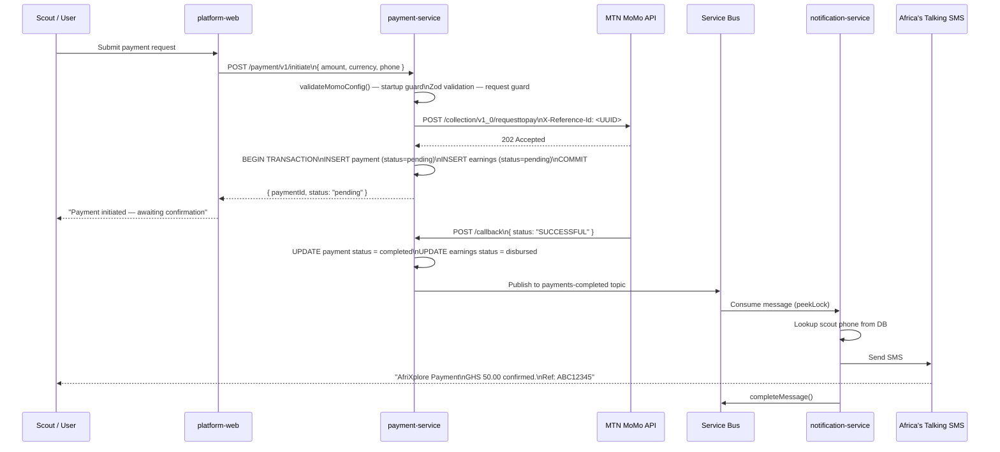
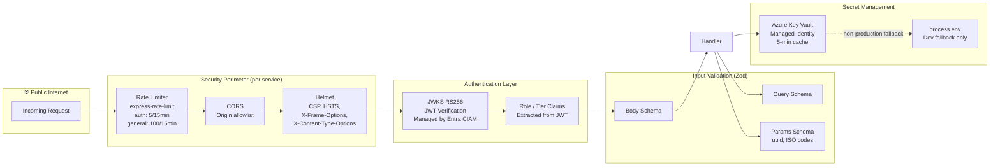

# AfriXplore — System Architecture

## High-Level Overview



## Authenticated API Call — Sequence Diagram



## MTN MoMo Payment Flow



## Security Architecture



## Service Dependency Map

```mermaid
graph LR
    subgraph Shared["packages/"]
        TEL[@afrixplore/telemetry]
        CFG[@afrixplore/config]
        VAL[@afrixplore/validation]
        AUTH[@afrixplore/auth]
        HEALTH[@afrixplore/health]
        TYPES[@afrixplore/types]
    end

    IA[intelligence-api] --> TEL & CFG & VAL
    SA[scout-api] --> TEL & CFG & VAL & AUTH
    PS[payment-service] --> TEL & CFG & VAL
    MA[msim-api] --> TEL & CFG & VAL
    AI[ai-inference] --> TEL
    NS[notification-service] --> TEL
    GW[geospatial-worker] --> TEL & TYPES
```
